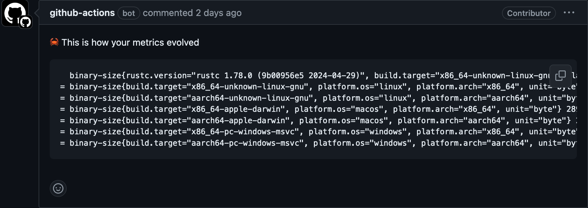

# Git Metrics

[](https://app.fossa.com/projects/git%2Bgithub.com%2Fjdrouet%2Fgit-metrics?ref=badge_shield)

Right now, if you want to track the evolution of some metrics for your project
over time, you need an external tool to store those metrics. But these metrics
could be stored withing the git repository. Git provides a mechanism of notes
that `git-metrics` simplifies.

## How to install

### From sources

```bash
cargo install --git https://github.com/jdrouet/git-metrics
```

## How to use it

### Locally

```bash
# fetch the remote metrics
$ git metrics pull
# add a new metric
$ git metrics add binary-size \
    --tag "platform.arch: amd64" \
    --tag "unit: byte" \
    1024.0
# push the metrics to remote
$ git metrics push
# log all the metrics for the past commits
$ git metrics log --filter-empty
# display the metrics on current commit
$ git metrics show
binary-size{platform.arch="amd64", unit="byte"} 1024.0
# display the metrics difference between commits
$ git metrics diff HEAD~2..HEAD
- binary-size{platform.arch="amd64", unit="byte"} 512.0
+ binary-size{platform.arch="amd64", unit="byte"} 1024.0 (+200.00 %)
```

### With a github action

With `git-metrics`, using [the GitHub actions](https://github.com/jdrouet/action-report-git-metrics), you can even add a report to every pull request that opens on your project.


[](https://app.fossa.com/projects/git%2Bgithub.com%2Fjdrouet%2Fgit-metrics?ref=badge_shield)

```yaml
name: monitoring metrics

on:
  pull_request:
    branches:
      - main
  push:
    branches:
      - main

jobs:
  building:
    runs-on: ubuntu-latest
    steps:
      - uses: actions/checkout@v3
        with:
          # this is needed for reporting metrics
          fetch-depth: 0
      # set the git identity to be able to save and push the metrics
      - uses: jdrouet/action-git-identity@main
      - uses: jdrouet/action-install-git-metrics@main
      - uses: jdrouet/action-execute-git-metrics@main
        with:
          pull: 'true'
          # set that to true when not a pull request
          push: ${{ github.event_name != 'pull_request' }}
          script: git-metrics add binary-size --tag "platform: linux" 1024
      # add a comment message to your pull request reporting the evolution
      - uses: jdrouet/action-report-git-metrics@main
        if: ${{ github.event_name == 'pull_request' }}
```

## Related projects

- GitHub action to install `git-metrics`: https://github.com/jdrouet/action-install-git-metrics
- GitHub action to execute `git-metrics`: https://github.com/jdrouet/action-execute-git-metrics
- GitHub action to report `git-metrics` diff: https://github.com/jdrouet/action-report-git-metrics

## Project goals

- [x] `git-metrics show` displays the metrics to the current commit
- [x] `git-metrics add` adds a metric to the current commit
- [x] `git-metrics remove` removes a metric from the current commit
- [x] `git-metrics fetch` fetches the metrics
- [x] `git-metrics push` pushes the metrics
- [x] `git-metrics log` displays the metrics for the last commits
- [x] `git-metrics diff` computes the diff of the metrics between 2 commits
- [ ] `git-metrics page` generates a web page with charts for every metrics
- [ ] add a way to create a budget and compare to it
- [ ] create an action to comment a PR with the comparison to the main branch


## License

[](https://app.fossa.com/projects/git%2Bgithub.com%2Fjdrouet%2Fgit-metrics?ref=badge_large)
